# 2026-04-03(금) 독일 행사 관련 사전간담회

## 1. 행사 운영 관련 (DIP)
### ■ 기본 구성
- 55인치 모니터 있음
- 회사 소개 영상 준비 (USB를 통한 PPT 애니메이션 활용 가능)
- 태그 + QR → 회사소개 페이지 연결
- 상담일지 즉시 작성 가능 (간단 메모 형태)
- 상담용 의자 배치 (심층 상담 진행)

### ■ 통역
- 1인당 1명 배정
- 회사 관련 자료 메일로 사전 전달 필요
- 통역사 정보: 메일 받은 후 2~3일 내 전달 예정

## 2. 이동 및 숙박
### ■ 이동
- 공항 → 호텔 → 행사장 이동
### ■ 숙박
- 호텔 조식, 중식 등 별도 비용
- 독일 도시세 별도 납부
### ■ 상세일정 및 숙소정보(DIP에서 예약)
- (1)프랑크프루트 1박(4/19~4/20): 엔하우(NHOW FRANKFURT)
- (2)프랑크프루트 1박(4/24~4/25): 엔하우
- (3)하노버 5박(4/20~4/24): 레오나르도 호텔 하노버>>바뀜

## 3. 준비물
### ■ 필수 준비
- 숙박비, 항공권 등
- 보조배터리 (기내 반입 제한 있으므로 확인 필요)
- 바람막이 등 방한 대비
- 비상약은 행사운영팀에서 준비함

### ■ 추가 준비
- 브로슈어 꽂이 : 필요하면 행사운영팀에 미리 전달
- 별도 멀티탭, 펜, 메모지 등
- 시연용 미니PC
- HDMI 케이블 (1개는 있음. 여분)
- 전원 공급 길이는 행사운영쪽에서 확인 후 전달하겠음

## 4. 전시 운영 유의사항
- 인터넷 미지원 → 테더링 활용

### ■ 홍보
- 전문 홍보요원 2명 추가 배치
- QR코드 포함 기념품(마스크팩) 활용

### ■ 비즈니스 전략
- 유럽: MOU보다 POC(기술 실증) 선호

## 5. 일정 운영
- 전날 행사장 출입 가능. 단, 보통 당일 현장 세팅 진행
- 마지막 날 15:30 철수 (조기 마무리 할 수 있게끔 할 예정)

## 6. 식사 및 기타 지원
- 기관별 네트워킹을 위한 뒷풀이 비용 지원

## 7. 참여 기관
- 대구: DIP 2명 (윤철진, 강길웅)
- 포항: 김승목 외 1명
- 부산: 부산산업진흥원 2명 (마정우)
- 경남: 경남테크노파크 2명 (강혜진, 이창석)

## 8. 사전 준비 사항
- 하노버 온라인샵 가입
- 배지 발급
- 사전 간담회 이후 자료 배포 예정

## 9. 총괄 지침
- 향후 쓰기위한 현지 사진은 각자 충분히 촬영
- 명함 100장 이상 배포
- 기관 및 업체 간 협력할 수 있도록 요청 

## 10. 비용 및 정산
- 인보이스: 원칙적으로는 부가세 제외
- 불가피한 경우 → 10% 부가세 추가하여 제출하면 처리 가능

## 관련 사진
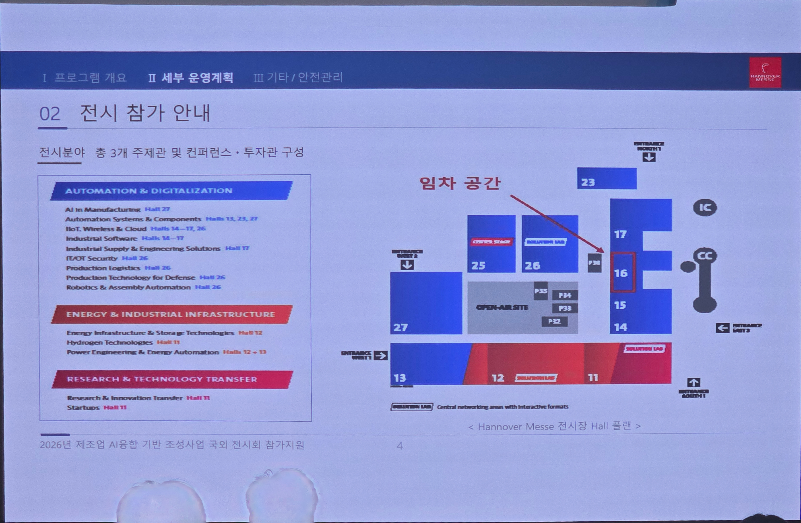
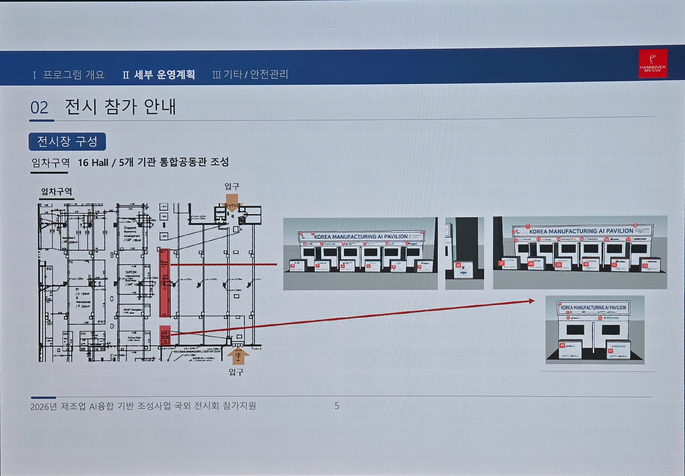
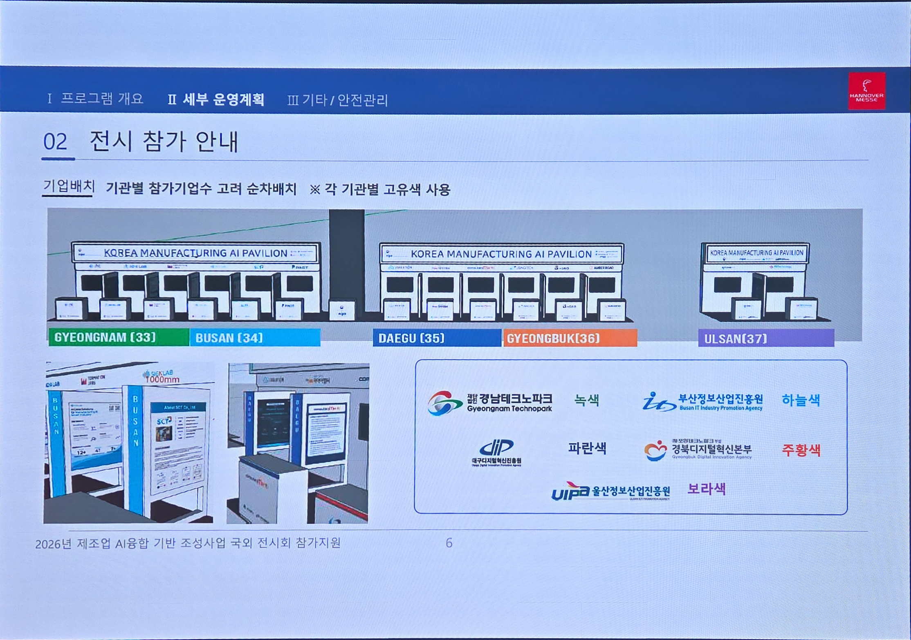
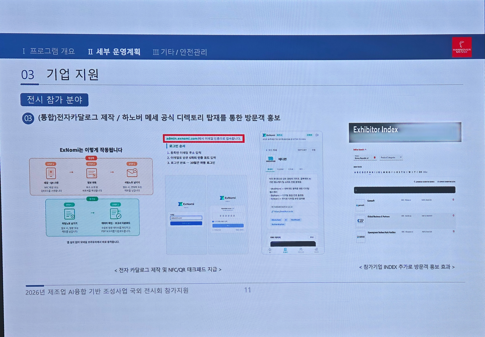
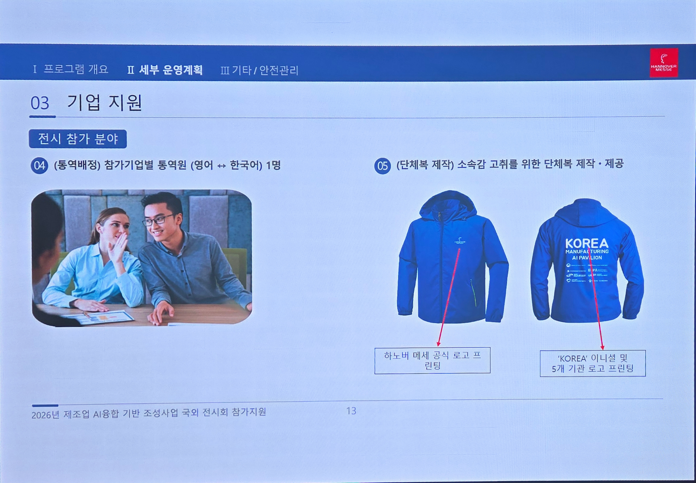
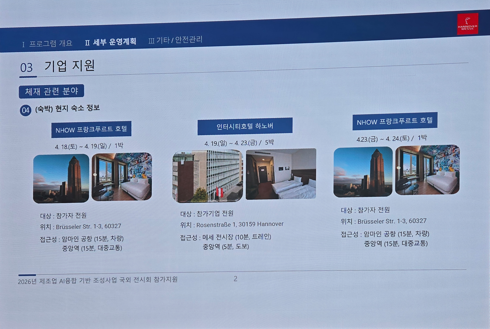
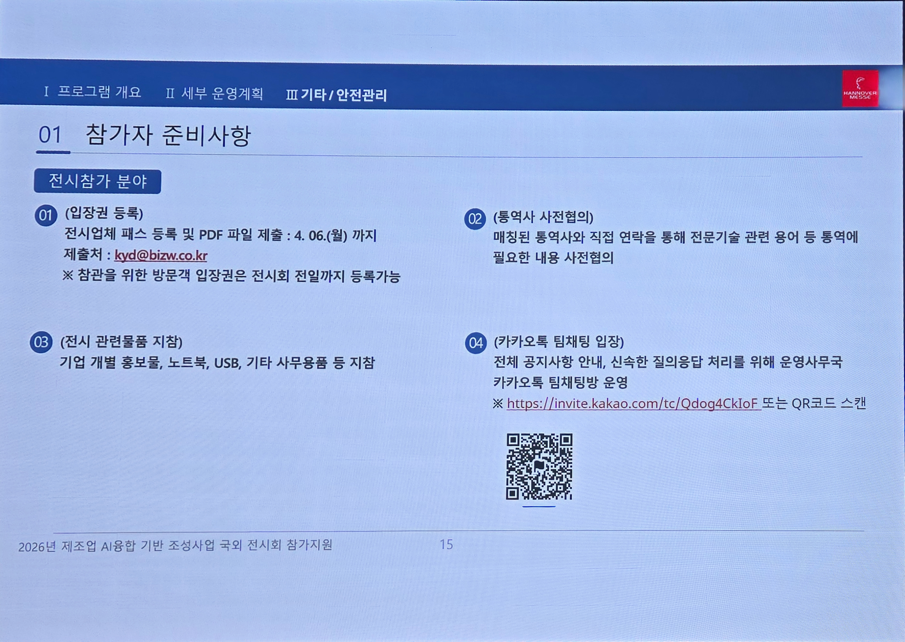
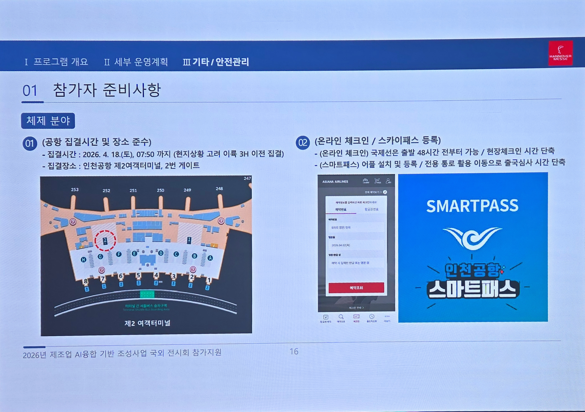
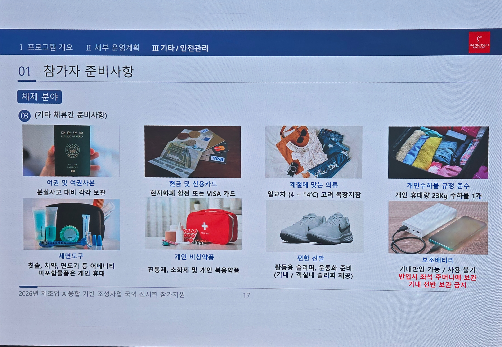
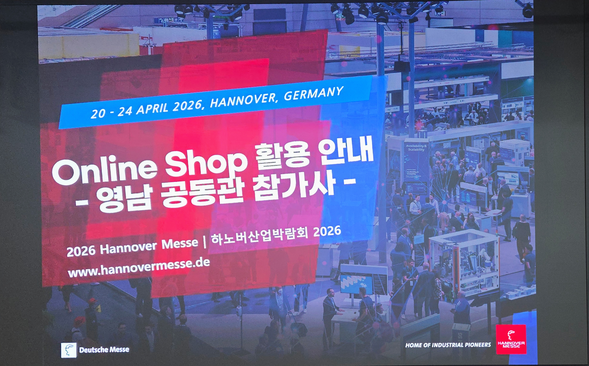
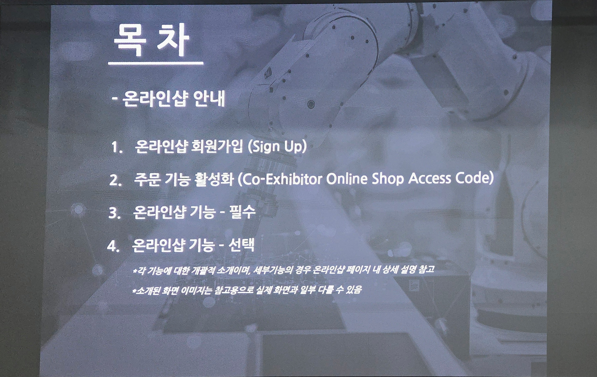
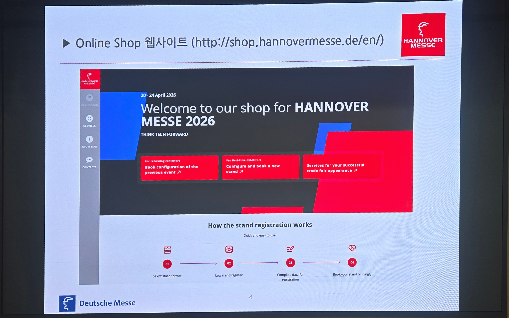